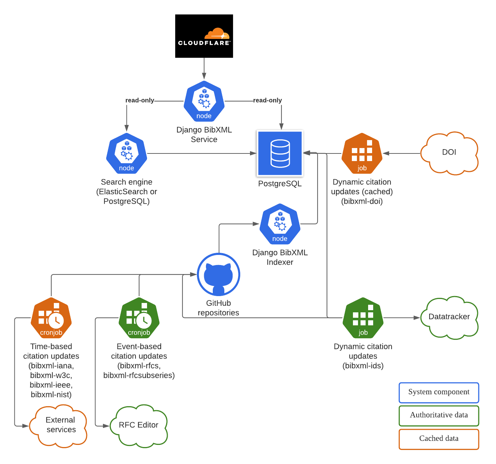

= IETF bibxml-project

== Full list of deliverables

> 1. An XML citation datastore with a mix of manually added
> persistent citations, generated persistent citations and
> citations that are generated on demand and then
> temporarily cached before being purged, organised into
> datasets as detailed below.
>
> 2. An interface to the datastore suitable as the data
> source for an rsync server so that datasets of persistent
> citations can be served by rsync.
>
> 3. Generation of XML citations from each of the sources
> detailed below and adding the generated citations to the
> datastore.
>
> 4. A public API for retrieval of one or more XML citations
> from the datastore, including those generated on demand.
>
> 5. A public API for searching and browsing over the
> datasets of persistent citations.
>
> 6. A private API for triggering a new generation or
> regeneration.
>
> 7. An interactive web page through which anyone can access
> any XML citations in the datastore, including those
> generated on demand.
>
> 8. For datasets of persistent citations, the interactive
> web page should provide searching and browsing over those
> datasets as well as download of the full dataset (zipped
> and gzipped tarballs).
>
> 9. A centralised single log of all access, including the
> import of rsync logs, to provide visibility into use of
> the service.
>
> 10. A Dockerfile that will be used in a full CI/CD
> environment.

== Deliverable: API definitions

An OpenAPI specification and accompanying guidance will be developed
for the BibXML Service with the aim that independent implementation
and external API usage is barrier-free.

This covers both the public and private API portions of the service.

== Deliverable: software components

=== Web application

A Django web application will be developed with the following functionality:

. interactive website that allows browsing XML citations in the datastore,
  including those fetched from authoritative sources:
  `bibxml-rfcs`, `bibxml-misc`, `bibxml-ids`, `bibxml-w3c`, `bibxml-3gpp`,
  `bibxml-ieee`, `bibxml-rfcsubseries`. We assume that `bibxml-iana` and `bibxml-doi`
  content do not need to be browseable because of their limited utility
  (the cache being incomplete dataset, each entry is only available for 24
  hours);

. public API that allows for retrieval of one or more XML citations from the
  datastore. This covers all the bibxml data sources. In the case of
  `bibxml-iana`, and `bibxml-doi`, a cached entry will be made available
  for up to 24-hours;

. public API that allows for searching over the datasets for IETF and external
  persistent citations via a search engine;

. private API that allows triggering of update routines that retrieves data
  from remote bibxml data sources;

. private API for performing updates to the citation datastore, for
  the updates to the IETF persistent citations (`bibxml-rfcs`, `bibxml-ids`,
  and `bibxml-rfcsubseries`);

. the authentication mechanism will integrate with Datatracker-generated
  or administratively provisioned API tokens;

. provide easy extensions to the output such that future formats including
  BibTeX and CSL can be rendered.

=== Citation importers

Software components will be provided for the import of external
citations, including new implementations for these datasets:

* `bibxml-w3c`
* `bibxml-3gpp`
* `bibxml-ieee`
* `bibxml-doi`
* `bibxml-iana`

== Deliverable: Infrastructure support

NOTE: Items described here are subject to improvement.

A Kubernetes setup will be used to run various Docker containers.
This setup makes it easier to mirror the production and local
development environments, given that Docker Desktop now supports a
single node Kubernetes cluster.

This setup forgoes the need for a database server to minimize maintenance
effort and ongoing costs.

The following components are needed:

. Software
.. Django BibXML Service application
.. BibXML data utilities as part of the BibXML Service package
  (used to fetch external citations, including rewritten `doilit`
  and other related scripts)
.. Mechanism to build search index from BibXML

. Infrastructure
.. A dataset storage location, which could be as part of the
  compute instance, a shared drive or a cloud volume;

.. Docker containers that run various components, including:
... the Django BibXML Service
... an ElasticSearch container
... the dataset storage location presented as a persistent volume
   via Kubernetes

.. A logging location is provided as a shared volume

.. A backup location (preferably in the cloud, such as AWS S3) for
  the dataset storage volume

. Infrastructure configuration

.. Configuration for general infrastructure deployment

.. Helm configuration used to parameterize environment-specific values
  between production and development

.. Definitions for Kubernetes cron jobs that will execute based
  on time-triggered citation updates (e.g. `bibxml-w3c`)

All created components will be delivered in an open source manner
as required.

The resulting architecture is shown here.

.Infrastructure architecture

